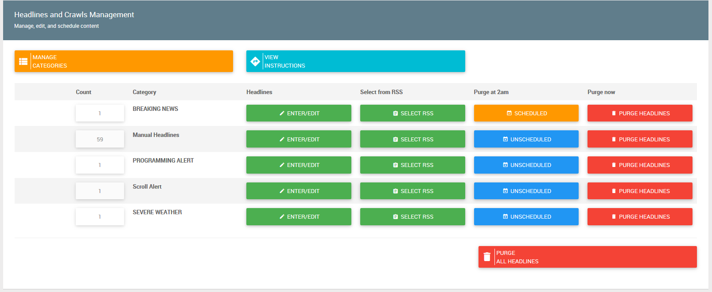
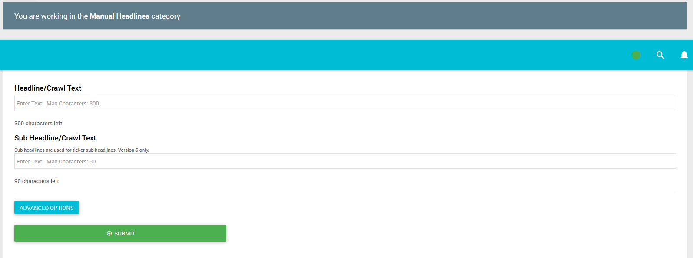
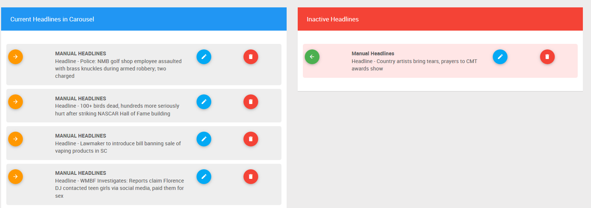

# Headlines and Crawls Overview

The Headlines & Crawls section is used to manually enter the headlines you want to run in the ticker as well as any informative crawls you would need to run such as breaking news or programming alerts.

- Count - This column reflects the number of headlines that are active in each category.
- Category - This column is the title of the category that you will be posting information to.
- Headlines - You can manually enter or edit headlines be clicking the "Enter/Edit" button corresponding to your category.
- Select from RSS - Select headlines from an RSS feed generated by your site or elsewhere.
- Purge - Purge all headlines in the corresponding category. 

!> You should purge Breaking News, Amber Alerts, Severe Weather and Programming Alerts IMMEDIATELY after they have expired. Doing so will reduce your chance of running old, outdated information.

## Adding a Manual Headline

Once you've clicked the 'Headlines' 'Enter/Edit' button you will arrive at the Manual Headlines form.

## Edit / Delete / Deactivate Manual Headline

 - Click the button next to the category you would like edit / delete or deactivate headlines in.

## Add a New Headline via RSS Feed
